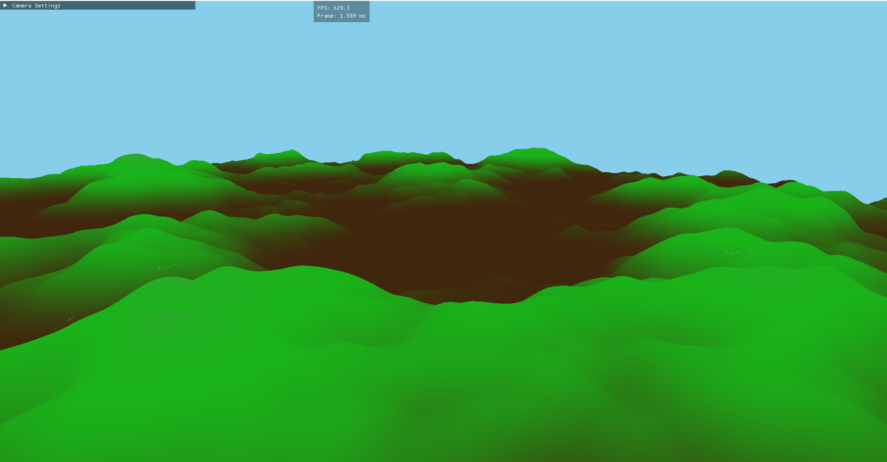

# Terrain Generation Engine

A high-performance procedural terrain generation and rendering system built with C++ and OpenGL, featuring infinite terrain generation, dynamic Level-of-Detail (LOD) management, and multi-threaded mesh generation.



## Features

### Core Capabilities
- **Infinite Terrain Generation**: Dynamically generates terrain chunks as the camera moves through the world
- **Multi-threaded LOD System**: Asynchronous chunk generation with three levels of detail (65x65, 33x33, 17x17 cells)
- **Frustum Culling**: Efficient rendering by culling chunks outside the camera view
- **Procedural Generation**: Fractal Perlin noise-based heightmap generation with configurable parameters
- **Real-time Camera Controls**: Free-fly camera with adjustable speed and mouse sensitivity

### Technical Highlights
- **Thread-safe Terrain Generation**: Mutex-protected generator access for safe multi-threaded operation
- **Distance-based LOD Selection**: Automatic LOD switching based on camera distance
- **Chunk Management**: Dynamic loading/unloading system to maintain performance
- **OpenMP Acceleration**: Parallel vertex and normal calculations for faster mesh generation

## Project Structure

```
├── Camera.h/cpp              # Free-fly camera implementation with frustum extraction
├── Terrain.h/cpp             # Main terrain manager with async chunk loading
├── TerrainChunk.h/cpp        # Individual chunk with multi-LOD support
├── TerrainGenerator.h/cpp    # Procedural heightmap generation using Perlin noise
├── Mesh.h/cpp                # OpenGL mesh rendering wrapper
├── MeshData.h/cpp            # Vertex and index data structures
├── Shader.h/cpp              # Shader program management
├── SkyBox.h/cpp              # Skybox rendering
├── TextureManager.h          # Texture loading and management
├── World.h/cpp               # Main world/scene manager
└── main.cpp                  # Application entry point with GLFW/ImGui setup
```

## Dependencies

- **GLFW**: Window and input management
- **GLAD**: OpenGL function loader
- **GLM**: Mathematics library for graphics
- **ImGui**: Immediate mode GUI for debug controls
- **stb_image**: Image loading
- **OpenMP**: Parallel processing (optional but recommended)

## Building

### Prerequisites
```bash
# Windows
./build_and_run.bat
```

## Usage

### Controls
- **W/A/S/D**: Move camera forward/left/backward/right
- **Space**: Move camera up
- **Left Shift**: Move camera down
- **Mouse**: Look around
- **ESC**: Toggle mouse lock/unlock cursor

### Configuration
The terrain generator can be configured via `TerrainGenerator::Params`:

```cpp
TerrainGenerator::Params params;
params.baseFrequency = 0.004f;  // Base noise frequency
params.octaves = 5;              // Number of noise octaves
params.persistence = 0.48f;      // Amplitude decay per octave
params.lacunarity = 2.0f;        // Frequency increase per octave
params.heightScale = 100.0f;     // Vertical scale multiplier
params.seed = 42;                // Random seed
```

### Performance Tuning
Key parameters in `Terrain.cpp`:
- `generateRadius`: Chunk generation radius (default: 16 chunks)
- `UNLOAD_DISTANCE`: Distance before chunks are unloaded (default: 1500.0)
- `MAX_NEW_REQUESTS_PER_FRAME`: Async generation limit per frame (default: 8)
- `UPDATE_INTERVAL`: Frames between terrain updates (default: 8)

## Architecture

### LOD System
The engine uses distance-based LOD with three levels:
- **LOD 0** (65x65): < 150 units - highest detail
- **LOD 1** (33x33): 150-300 units - medium detail  
- **LOD 2** (17x17): > 300 units - lowest detail

### Async Generation Pipeline
1. Camera movement triggers chunk requests
2. `requestChunkAsync()` spawns async tasks with mutex-protected generator access
3. `finalizeReadyFutures()` builds GPU meshes from completed tasks
4. Chunks are rendered with appropriate LOD based on distance

### Thread Safety
- `generatorMutex` protects all `TerrainGenerator` operations
- Future-based async system prevents race conditions
- Atomic operations used for normal calculation accumulation

## Performance Characteristics

- **Initial Generation**: ~16² chunks loaded synchronously at startup
- **Runtime Loading**: Max 8 chunks generated per frame asynchronously
- **Memory Management**: Chunks beyond 1500 units are automatically unloaded
- **Rendering**: Only chunks within camera frustum are drawn

## Shader Pipeline

The project includes shaders for:
- Terrain rendering with height-based coloring
- Skybox rendering with depth optimization
- Normal-based lighting (vertex normals computed per-triangle)

## Known Limitations

- Chunk seams may be visible at LOD transitions
- No texture splatting (uses vertex colors)
- No collision detection implemented
- Single-threaded OpenGL calls (mesh upload is synchronous)

## Future Enhancements

- [ ] Implement chunk stitching to eliminate LOD seams
- [ ] Add texture splatting based on height/slope
- [ ] Implement GPU-based tessellation
- [ ] Add water rendering
- [ ] Implement physics/collision system
- [ ] Save/load terrain to disk

## License

This project is provided as-is for educational purposes.

## Credits

Developed using modern C++17, OpenGL 3.3 Core, and various open-source libraries.